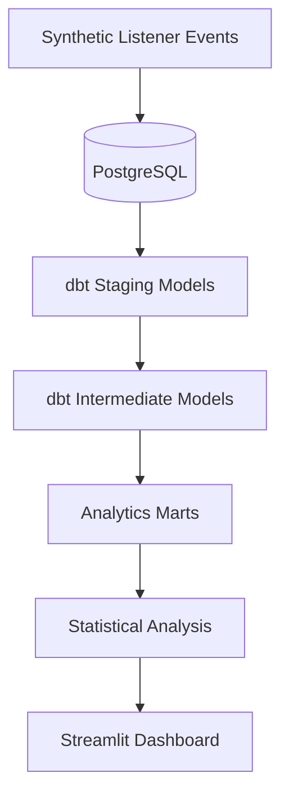

# TuneLift

**Music Promotion Experimentation & Incrementality Platform**

TuneLift is a product analytics and experimentation platform for measuring whether music promotion creates **incremental listener engagement**, not just additional exposure.

It simulates a music-streaming promotion environment with treatment and control groups and analyzes the effect of promotion on streaming, saves, skips, repeat listening, artist follows, playlist adds, and long-term retention.

---

## Key Features

- A/B experimentation with treatment and control groups
- Absolute and relative conversion lift
- Incremental stream estimation
- Statistical significance testing
- 95% confidence intervals
- Statistical power analysis
- Minimum detectable effect
- Sample-ratio-mismatch checks
- Product guardrail metrics
- Listener segmentation
- Campaign-level analysis
- 7-day, 14-day, and 30-day retention
- dbt analytics pipeline
- Interactive Streamlit dashboard

---

## Dashboard

TuneLift is organized into seven product analytics views:

| Tab | Purpose |
|---|---|
| **Overview** | High-level promotion KPIs and listener response |
| **Experiment** | P-values, confidence intervals, power, MDE, and experiment health |
| **Guardrails** | Skips, saves, repeat listening, artist follows, and playlist adds |
| **Retention** | 7-day, 14-day, and 30-day listener retention |
| **Campaigns** | Campaign-level incremental lift |
| **Audience** | Treatment effects across listener segments |
| **Tracks** | Promoted-track performance |

The dashboard uses a dark, music-streaming-inspired interface with interactive filters and charts.

---

## Architecture



### Data Flow

```text
Synthetic Data
      ↓
PostgreSQL
      ↓
dbt Staging
      ↓
dbt Intermediate Models
      ↓
Analytics Marts
      ↓
Experiment Analysis
      ↓
Streamlit Dashboard
```

---

## Data Model

### Raw PostgreSQL Tables

- `listeners`
- `artists`
- `tracks`
- `campaigns`
- `experiment_events`
- `retention_events`

### dbt Models

**Staging**

- `stg_listeners`
- `stg_artists`
- `stg_tracks`
- `stg_campaigns`
- `stg_experiment_events`
- `stg_retention_events`

**Intermediate**

- `int_listener_campaign_events`

**Analytics Marts**

- `fct_promotion_events`
- `fct_campaign_performance`
- `fct_experiment_results`

The Streamlit application reads from the dbt analytics layer rather than joining raw operational tables directly.

---

## Experiment Design

Listeners are assigned to one of two groups:

| Group | Experience |
|---|---|
| **Treatment** | Receives the promotional recommendation |
| **Control** | Receives the standard recommendation experience |

### Absolute Lift

```text
Absolute Lift =
Treatment Conversion Rate - Control Conversion Rate
```

For example:

```text
Treatment Stream Rate = 27.2%
Control Stream Rate   = 20.7%

Absolute Lift = 6.5 percentage points
```

### Relative Lift

```text
Relative Lift =
(Treatment Rate - Control Rate) / Control Rate
```

### Incremental Streams

```text
Incremental Streams =
Absolute Lift × Treatment Impressions
```

This estimates how many additional streams are associated with the promotional treatment beyond what would likely have occurred under the control experience.

---

## Statistical Analysis

TuneLift uses a **two-proportion z-test** to compare treatment and control stream conversion rates.

The experiment dashboard reports:

- Treatment conversion rate
- Control conversion rate
- Absolute lift
- Relative lift
- P-value
- 95% confidence interval
- Sample size
- Statistical significance

### Example Interpretation

If the 95% confidence interval for the treatment effect does not include zero and the p-value is below `0.05`, the observed difference is treated as statistically distinguishable from zero at the 5% significance level.

---

## Experiment Health

A statistically significant result is not automatically a trustworthy experiment.

TuneLift also evaluates:

### Statistical Power

Estimates whether the experiment has enough observations to detect an effect of the observed size.

### Minimum Detectable Effect

Estimates the smallest treatment effect the experiment can reliably detect at its current sample size.

### Sample Ratio Mismatch

Checks whether treatment and control traffic were distributed roughly as expected.

Unexpected assignment imbalance can indicate problems with randomization, instrumentation, or data collection.

---

## Guardrail Metrics

Increasing streams is useful only if the promotion does not damage the listener experience.

TuneLift monitors:

| Metric | Interpretation |
|---|---|
| **Skip Rate** | Lower is generally better |
| **Save Rate** | Indicates stronger interest in the track |
| **Repeat Listening** | Indicates listeners returned to the song |
| **Artist Follow Rate** | Connects promotion to audience growth |
| **Playlist Add Rate** | Indicates intent to listen again later |

A strong product result should improve the primary metric without causing meaningful deterioration in guardrail metrics.

---

## Retention Analysis

TuneLift measures whether listeners return after their initial promoted stream.

Retention is measured at:

- **7 days**
- **14 days**
- **30 days**

This helps distinguish a temporary promotional spike from longer-term listener engagement.

---

## Audience Analysis

Promotion lift can be explored across:

- Preferred genre
- Country
- Subscription type
- Genre match
- Age group
- Listener activity level

This helps identify whether different listener groups respond differently to promotional recommendations.

---

## Tech Stack

### Data Science

- Python
- Pandas
- NumPy
- SciPy
- Statsmodels
- scikit-learn

### Analytics Engineering

- SQL
- dbt
- PostgreSQL

### Visualization

- Streamlit
- Plotly

### Infrastructure & Testing

- Docker
- Git
- pytest

---

## Project Structure

```text
tunelift/
├── dashboard/
│   └── app.py
│
├── dbt_project/
│   ├── models/
│   │   ├── staging/
│   │   ├── intermediate/
│   │   └── marts/
│   └── dbt_project.yml
│
├── src/
│   ├── database.py
│   ├── generate_data.py
│   ├── generate_retention.py
│   ├── experiment_stats.py
│   ├── experiment_health.py
│   ├── guardrails.py
│   └── retention.py
│
├── tests/
├── data/
├── docker-compose.yml
├── requirements.txt
└── README.md
```

---

## Run Locally

### 1. Clone the repository

```bash
git clone <YOUR-REPOSITORY-URL>
cd tunelift
```

### 2. Create a virtual environment

```bash
python3 -m venv .venv
source .venv/bin/activate
```

### 3. Install dependencies

```bash
pip install -r requirements.txt
```

### 4. Start PostgreSQL

```bash
docker compose up -d
```

### 5. Generate synthetic experiment data

```bash
python src/generate_data.py
python src/generate_retention.py
```

### 6. Build the analytics models

```bash
cd dbt_project
dbt run
dbt test
cd ..
```

### 7. Launch TuneLift

```bash
python -m streamlit run dashboard/app.py
```

Then open:

```text
http://localhost:8501
```

---

## Testing

Run the Python test suite:

```bash
pytest -v
```

Run dbt data-quality tests:

```bash
cd dbt_project
dbt test
```

---

## Data Disclaimer

TuneLift uses **fully synthetic listener, artist, track, and campaign data** generated locally for demonstration purposes.

It does not use Spotify proprietary data.

---

## Project Goal

TuneLift demonstrates an end-to-end product data science workflow:

**instrumentation → analytics engineering → experimentation → statistical inference → guardrails → retention → stakeholder-facing reporting**

The goal is to show how data science can be used to evaluate whether a promotional product creates meaningful, incremental value for both listeners and music creators.
